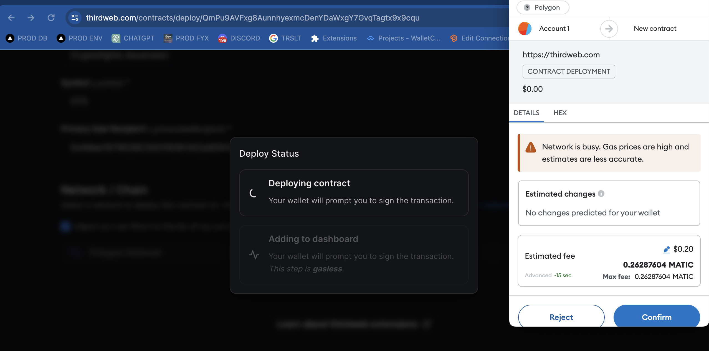
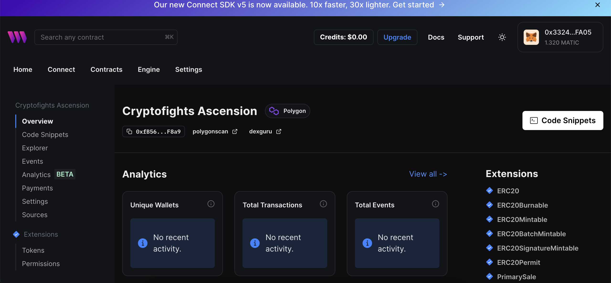
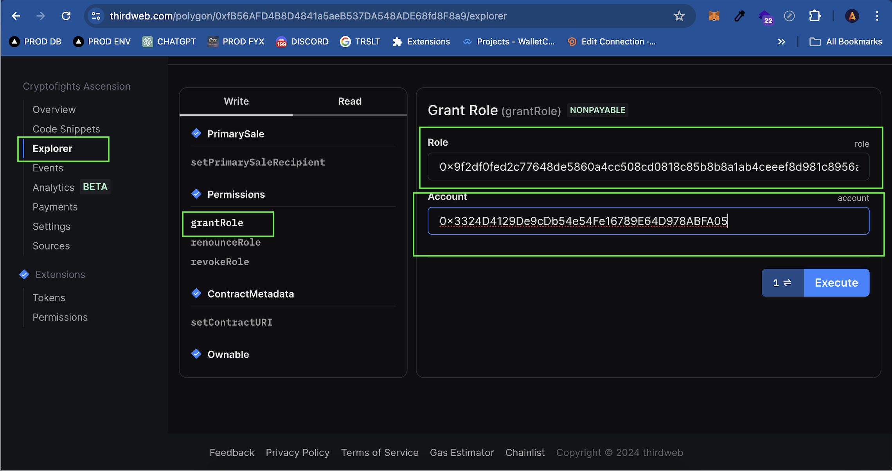
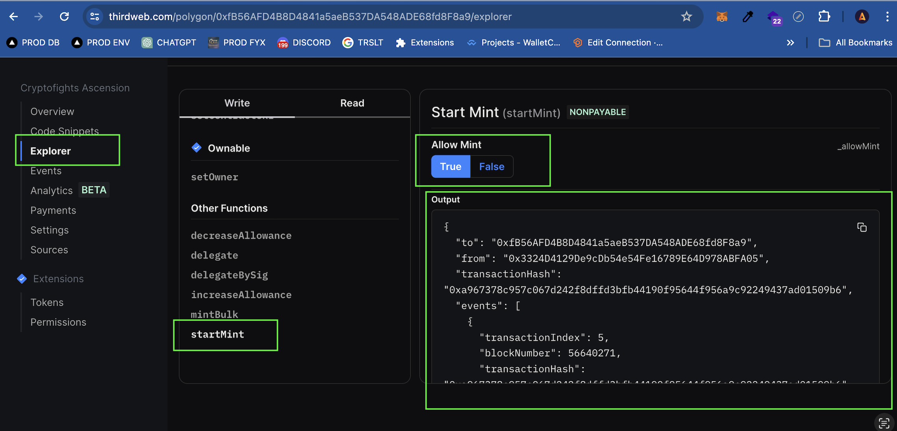
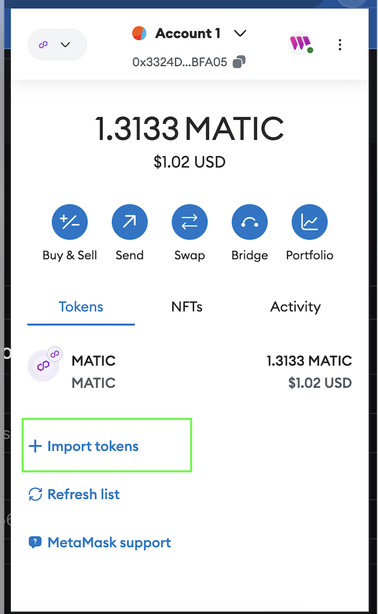
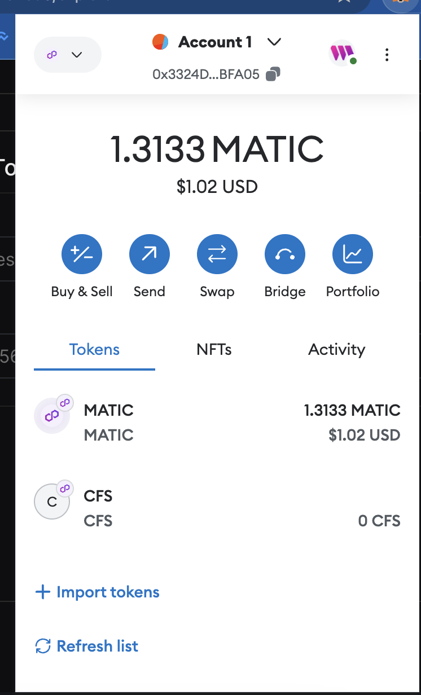
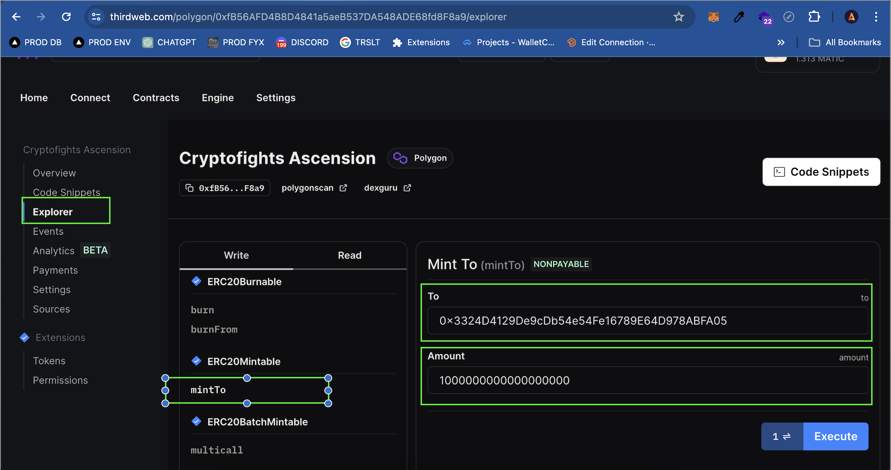
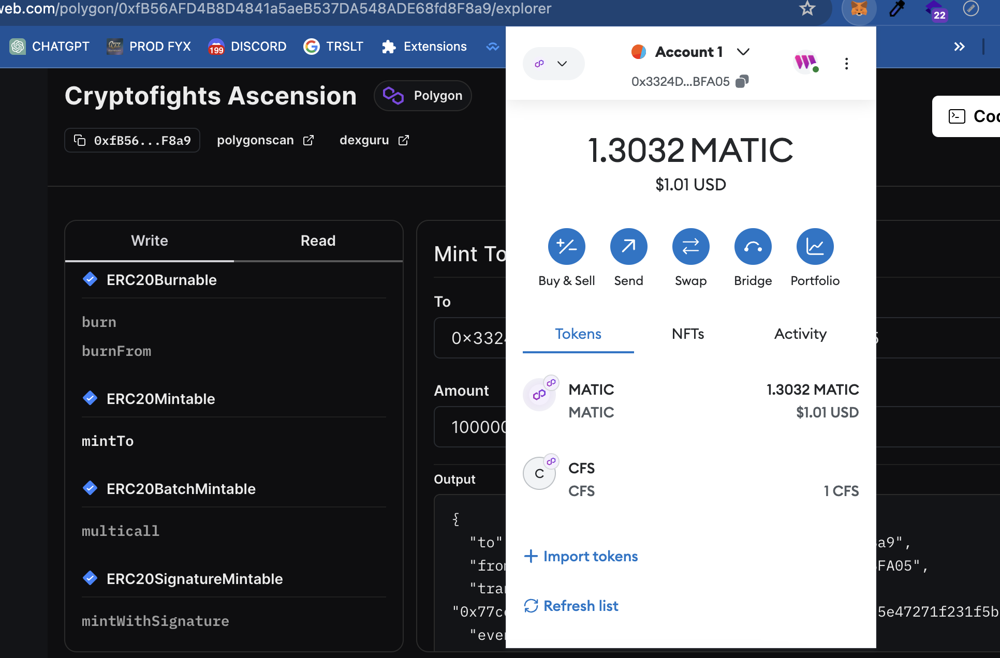

## Getting Started

### Create a contract with this repo code:

#### Requirements
1. Wallet for owner contract, has some MATIC on that because creating contract and signing every permissions needs gas fee.
2. Yarn package manager
3. Thirdweb Account (https://thirdweb.com/thirdweb.eth)

#### Steps
1. Clone this repo
2. Prepare the owner wallet in the browser extension would be easier.
3. Open this contract code folder in terminal.
4. Run this command in the terminal in this folder "yarn", it will install all libraries.
5. Then run 'yarn deploy', you will get a link to Thirdweb dashboard like this: 
   Open this link to deploy your contracts: https://thirdweb.com/contracts/deploy/QmPu9AVFxg8AunnhyexmcDenYDaWxgY7GvqTagtx9x9cqu
6. Fill the form in the image below and replace the primary address with your wallet address.
   
7. Click deploy now.
8. Click 'Sign' for every popup like this one: 
9. Success contract: 
10. Next, we need to assign our wallet as MINTER_ROLE and update AllowMint flag to enable minting mode.
11. To assign a wallet to be a minter wallet, we calculate the keccak256 string of 'MINTER_ROLE' with this website: https://emn178.github.io/online-tools/keccak_256.html and get the result '0x9f2df0fed2c77648de5860a4cc508cd0818c85b8b8a1ab4ceeef8d981c8956a6'.
12. Grant 'MINTER_ROLE' to your wallet with the address you want to be a minter. You will also use this step to register a wallet minter scheduler:
   
13. Click execute and sign the request. If it shows output, it means success.
14. Then, switch to the mint mode by updating the AllowMint flag:
   
15. Until this step is finished, you can see the contract address. You can check it on Polygonscan: https://polygonscan.com/address/[contract-address].
16. If you want to mint CFS token, follow these steps:
   1. Add the CFS token to your wallet by clicking 'Import Token' in MetaMask and filling the CFS contract address:
      
   2. Our CFS token does not have an image. We need to verify our token in MetaMask to show the CFS image as default. An alternative way to add the image is handled in the gateway when registering an address for staking rewards.
      
   3. To mint tokens, fill in the form like this:
      
      Note: Send 1 token requires filling 1 * 10^18 (only for the Thirdweb web, be aware of this if you want to mint with another app).
17. Click execute and you will see the result:
   
18. Next, if you want to register a wallet as a minter, you only need to do steps 11-13.


### Create a contract from scratch:

```bash
npx thirdweb create --contract --template hardhat-javascript-starter
```

You can start editing the page by modifying `contracts/Contract.sol`.

To add functionality to your contracts, you can use the `@thirdweb-dev/contracts` package which provides base contracts and extensions to inherit. The package is already installed with this project. Head to our [Contracts Extensions Docs](https://portal.thirdweb.com/contractkit) to learn more.

## Building the project

After any changes to the contract, run:

```bash
npm run build
# or
yarn build
```

to compile your contracts. This will also detect the [Contracts Extensions Docs](https://portal.thirdweb.com/contractkit) detected on your contract.

## Deploying Contracts

When you're ready to deploy your contracts, just run one of the following command to deploy you're contracts:

```bash
npm run deploy
# or
yarn deploy
```

## Releasing Contracts

If you want to release a version of your contracts publicly, you can use one of the followings command:

```bash
npm run release
# or
yarn release
```

## Join our Discord!

For any questions, suggestions, join our discord at [https://discord.gg/thirdweb](https://discord.gg/thirdweb).
