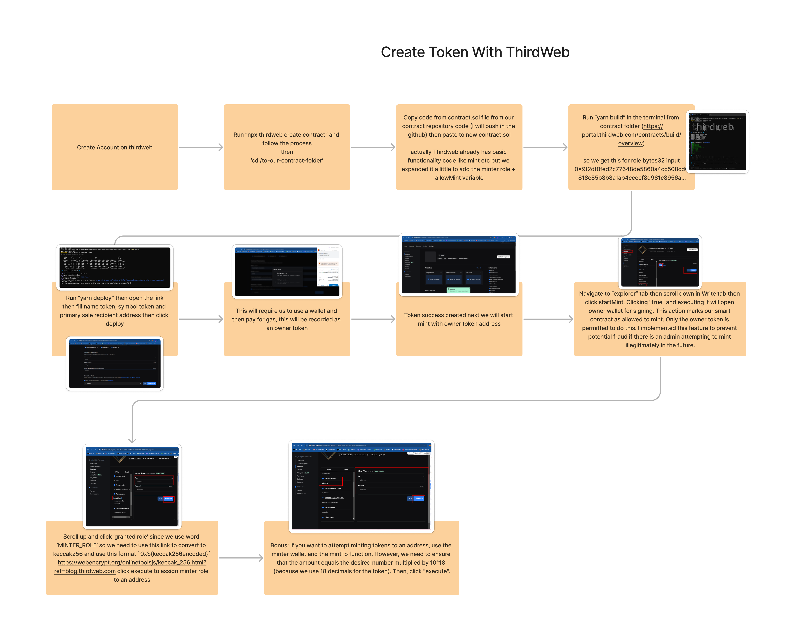

# CFS Token Contracts

## Create Token Flow with Thirdweb

## Overview

- We created our token on the Thirdweb platform.
- Thirdweb provides basic contract features, so we don't need to start from scratch; we only need to make minor modifications.
- We created the CFS token on the Polygon network for staging and production.

## Features

- **Mint Token:** We check the current status using an API transaction with an RPC URL, previously waiting for a block.
- **Mint Bulk Token:** During import, we wait for the transaction to succeed before proceeding with `redeemItem`. For `DestroyItem`, we still first destroy it on the API.
- **Burn:** It automatically refunds items related to lost game items. In the case of failed blockchain transactions, a refund is initiated.
- **Other basic features from Thirdweb:** [Thirdweb Documentation](https://portal.thirdweb.com/contracts/build/base-contracts/erc-20/signature-mint-vote)

## Getting Started

### Prerequisites

- **Wallet Account (Metamask Extension Preferred):** You need an authorized wallet account to view our contract on the Thirdweb platform.

### Go to Thirdweb

1. Visit Thirdweb [here](https://thirdweb.com/explore) and sign in with your wallet.
2. Import your token contract address; for example, our Polygon staging contract address is `0x7165F7572df770770639703D811406395bd6008C`.
3. Request the owner to assign your address as a Minter role if you wish to have minter abilities.
4. If you want to re-deploy contract, you can ask previous owner to transfer ownership

### Last contract address
1. POLYGON PRODUCTION = 0x4Ce002838FeDc9cc4943c97822a27ec32C9BA414
2. POLYGON STAGING = 0x7165F7572df770770639703D811406395bd6008C
3. SEPOLIA STAGING = 0x5a6A5b261a620D814E68C3797aB9663b6C8b31b7
